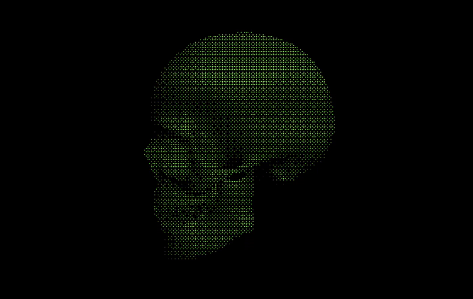
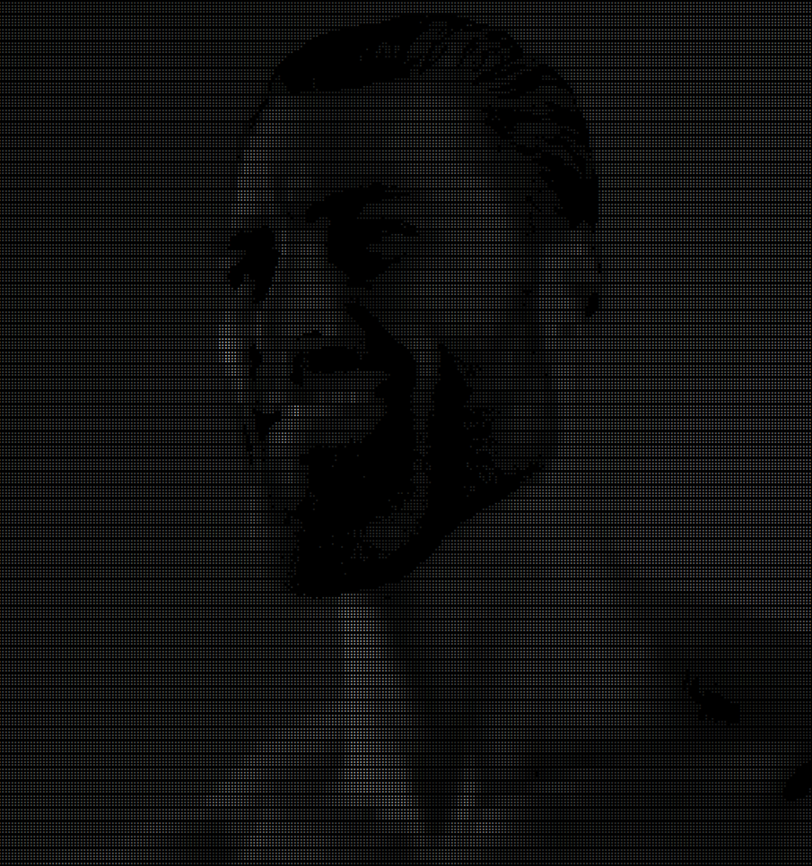
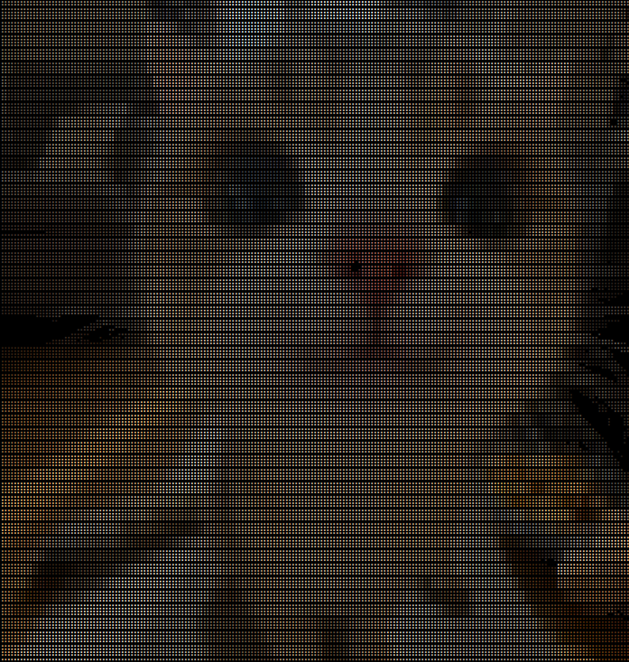

# TermRender

Render images, videos, and webcam frames directly in the terminal.

TermRender provides a small unified CLI over the existing ASCII and Unicode Braille renderers. It can display still images, stream video files, and preview live camera input without leaving your shell.

<p align="center">
  
  
</p>

## Supported

- ASCII rendering
- Unicode Braille rendering
- 24-bit color Braille rendering
- Image input
- Video file input
- Webcam / camera input
- Width control for terminal-sized output
- Braille threshold and dithering controls
- Optional mirror mode for camera-style previews
- Legacy standalone scripts for ASCII and Braille
- Advanced OBJ rendering through the original CPU / CUDA 3D engine

## Install

Python 3.8+ is recommended.

```bash
pip install pillow numpy opencv-python
```

For the optional CUDA / Taichi 3D backend:

```bash
pip install taichi
```

If you are using the local conda setup for this project:

```bash
conda activate yolo
```

## Unified CLI

<p align="center">
  
  
</p>

Use `termrender.py` as the main entry point.

```bash
python termrender.py --help
```

### Images

```bash
# Image to ASCII
python termrender.py image photo.jpg --mode ascii

# Image to Unicode Braille
python termrender.py image photo.jpg --mode braille

# Image to 24-bit color Braille
python termrender.py image photo.jpg --mode braille --color

# Braille with dithering and fixed max width
python termrender.py image photo.jpg --mode braille --dither bayer8 --width 120
```

### Video

```bash
# Video to Braille
python termrender.py video clip.mp4 --mode braille

# Color Braille video at a target FPS
python termrender.py video clip.mp4 --mode braille --color --fps 24

# Video to ASCII
python termrender.py video clip.mp4 --mode ascii --width 100
```

### Camera

```bash
# Camera 0 to Braille
python termrender.py camera 0 --mode braille

# Mirrored color camera preview
python termrender.py camera 0 --mode braille --color --mirror

# Camera preview in ASCII
python termrender.py camera 0 --mode ascii --width 100 --mirror
```

## CLI Options

| Option | Description |
|--------|-------------|
| `--mode {ascii,braille}` | Rendering backend. Defaults to `braille`. |
| `--width WIDTH` | Maximum terminal output width. |
| `--workers WORKERS` | Worker process count for ASCII rendering. |
| `--threshold VALUE` | Braille threshold from `0` to `255`. Defaults to `127`. |
| `--dither MODE` | Braille dithering mode: `bayer4`, `bayer8`, `threshold`, or `floyd-steinberg`. |
| `--color` | Enable 24-bit TrueColor Braille output. |
| `--mirror` | Mirror the frame horizontally. Useful for webcam previews. |
| `--fps FPS` | Target FPS for video and camera streams. Defaults to `30`. |

## Legacy Entry Points

The original scripts still work and remain useful for direct backend testing.

```bash
# Standalone image-to-ASCII renderer
python bayer_pattern.py photo.jpg --watch

# Standalone image-to-Braille renderer
python braille_art.py --image photo.jpg --dither bayer8 --color

# Standalone video / webcam Braille renderer
python braille_art.py --file video.mp4 --fps 24 --color
python braille_art.py --camera 0 --fps 30 --color --mirror
```

## 3D OBJ Renderer

The repository also includes the original terminal 3D rasterizer for OBJ models.

It does not rely on OpenGL, DirectX, or Vulkan. The graphics pipeline is implemented in Python, including MVP transforms, near-plane clipping, barycentric interpolation, and terminal output.

```bash
# GPU accelerated mode
python mvp_re_engine.py obj_list/agera.obj --backend gpu --color --interactive

# CPU multi-core mode
python mvp_re_engine.py obj_list/agera.obj --backend cpu --workers 44 --color
```

### 3D Backend Notes

- `mvp_re_engine.py`: OBJ parsing, MVP transforms, clipping, and CPU multiprocessing scheduling.
- `cuda_engine.py`: Taichi CUDA backend with visibility-buffer rasterization.
- `braille_art.py`: Unicode Braille and ANSI TrueColor terminal output helpers.
- `bayer_pattern.py`: ASCII frame rendering backend.
- `termrender.py`: Unified image / video / camera CLI.

## Technical Notes

| Feature | Specification |
|---------|---------------|
| Text modes | ASCII, Unicode Braille |
| Color output | ANSI 24-bit TrueColor for Braille |
| Input formats | Images, videos, webcams, OBJ models |
| Image backend | Pillow |
| Video / camera backend | OpenCV |
| 3D GPU backend | Taichi CUDA |
| Terminal protocol | ANSI escape sequences |

Author: Li-Wei Jiang

License: MIT
